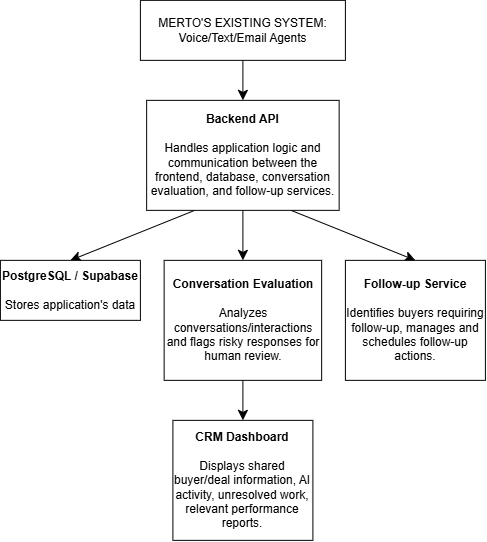
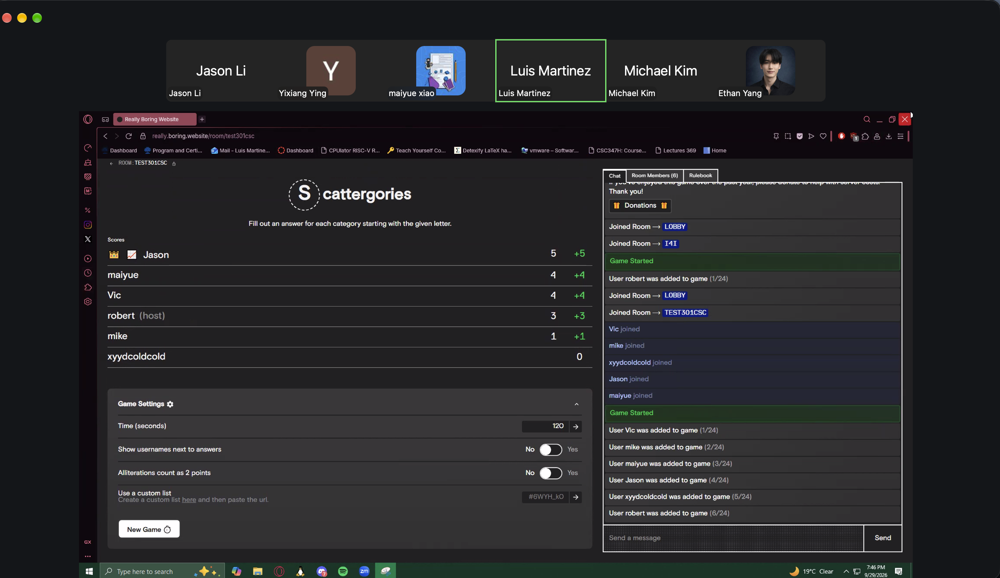

# YOUR PRODUCT/TEAM NAME

> _Note:_ This document will evolve throughout your project. You commit regularly to this file while working on the project (especially edits/additions/deletions to the _Highlights_ section).
> **This document will serve as a master plan between your team, your partner and your TA.**

## Product Details

#### Q1: What is the product?

**A web-based workspace that lets car dealership managers see, in one place, every buyer their AI agents and staff are working with, how well those conversations are going, and which buyers are falling through the cracks.**

**Partner.** Our partner is Merto, a startup building the data "infrastructure layer" for AI-assisted car sales. Our contacts are Muneeb and Oliver, the leads of Merto's development team. Muneeb is our primary point of contact (admin@merto.ai); Oliver is our secondary contact.

**The problem.** Buying a car involves a long chain of people. A buyer who sends an online inquiry is typically answered first by an AI agent or a BDC (Business Development Centre) representative, then handed to a salesperson for a test drive, an appraiser for their trade-in, a sales manager to negotiate price, and finally a finance manager. Each handoff loses information. For example:

- An AI agent tells a buyer over text that the dealership can "probably get close to $59,500 out the door", but the sales manager who picks up the deal the next day has no idea this was said.
- A buyer mentions a competing offer from another dealership and a 5 p.m. deadline, but nobody notices until it has passed.
- A buyer asks for financing information, receives an automated reply, and then hears nothing for three days before buying elsewhere.

Dealerships are increasingly putting AI agents in front of buyers, which makes this worse: managers can no longer easily see what was said on the dealership's behalf, or whether it was said well.

**What we are building.** Merto's long-term vision is a single shared buyer and deal history (trade-ins, appointments, promises made) that every person and AI agent involved in a sale can rely on. Our project is a **standalone web application** built on top of that idea, which Merto plans to integrate into its product later. It has three modules, in the priority order Merto set:

1. **Manager dashboard (priority 1).** A live overview of all active buyers and deals: which stage each is at, which AI agent and staff members are handling it, key metrics (response time, appointments booked, escalation rate), a log of everything the AI agents did, and a queue of unresolved items that need a human decision.
2. **Conversation evaluation.** Scores each AI-buyer conversation for quality and flags weak or risky AI responses (for example, an incorrect price quote or an unanswered question) so managers can review them.
3. **Follow-up tracking.** Detects buyers who have not been followed up on in time and surfaces what they still need (a quote, a document, a callback) so the sale is not lost.

**First mockup:** [Manager Analytics Dashboard (Figma Make)](https://www.figma.com/make/h6Sdmrc6AsJxeOVEOwmGn5/Manager-Analytics-Dashboard--Copy-?fullscreen=1)

#### Q2: Who are your target users?

Our users are staff at franchise or independent car dealerships that use AI agents to handle buyer inquiries. We have three personas, in priority order:

**1. Primary user: the dealership sales manager (e.g., "Dana", General Sales Manager)**
- Oversees 8–15 salespeople and BDC reps, plus several AI agents that answer web, phone and text leads.
- Is judged on monthly units sold and gross profit per deal, so a single lost buyer matters.
- Spends much of the day approving prices, handling escalations and chasing staff for updates, often from the showroom floor between customer conversations.
- **Needs:** one screen showing which deals need her decision right now, what the AI agents have told buyers, and whether the team is responding fast enough.

**2. Secondary user: the salesperson or BDC representative (e.g., "Marcus", Sales Consultant)**
- Takes over buyers after the AI agent qualifies them or books an appointment.
- Juggles 20–40 active buyers at a time across phone, text and email.
- **Needs:** the full history of a buyer he is picking up (vehicle of interest, trade-in, what was promised) and a reminder when a buyer is due for follow-up.

**3. Secondary user: the finance manager (e.g., "Priya", F&I Manager)**
- Arranges financing at the end of the sale and depends on documents and information collected earlier.
- **Needs:** to see which buyers are waiting on her and what they have already been told about rates and terms.

**Indirect stakeholder: Merto's team.** Merto will integrate our modules into its product, so the data model and interfaces must be clear and well documented for their developers.

#### Q3: Why would your users choose your product? What are they using today to solve their problem/need?
#### Problem raised by Merto's AI
Dealership managers currently rely on manual spot-checks, basic CRM reports, and largely unmonitored AI agents to oversee customer interactions. These approaches are time-consuming, provide limited visibility into AI performance, and may introduce errors or missed follow-ups to go undetected.

#### Benefits of our applications
#### 1. Manager-Facing Analytics Dashboard

Provides managers with clear, actionable performance metrics such as response time, escalation rate, appointment bookings, and conversion barriers. The dashboard gives managers greater visibility into AI agent performance and customer interactions, helping them identify trends and potential issues.
#### 2. Automated Conversation Evaluation Pipeline

Replaces time-consuming manual transcript reviews with an automated scoring system that evaluates conversations and flags risky or low-quality interactions for human review. This allows managers to focus on conversations that require intervention, as well as helping identify and correct AI mistakes before they harm customer relationships.
#### 3. Automatic Follow-Up System

Automatically re-engage unconverted or inactive leads according to structured follow-up cadences. This reduces manual workload while ensuring that leads receive consistent and timely follow-up instead of being overlooked.
#### Alignment with Merto's AI mandate
These systems work together to support Merto.ai's goal of delivering reliable, production-grade AI for automotive dealerships by combining automation, quality control, and executive visibility.
#### Q4: What are the user stories that make up the Minumum Viable Product (MVP)?
We will be implementing three main features, in the following priority:

1. AI CRM Dashboard

2. Conversation Evaluation
3. Follow-up System

Prototype link: https://www.figma.com/make/h6Sdmrc6AsJxeOVEOwmGn5/Manager-Analytics-Dashboard--Copy-?fullscreen=1&t=GLdQLfJDAHl8pu7w-1&code-node-id=0-6
## CRM/Dashboard
### US1: View Buyer and Deal History

#### User Story

As a dealership manager, I want to view a dashboard of buyers and their deal history in order to understand the current status of each buyer.

#### Acceptance Criteria

- The dashboard displays a list of buyers.

- Each buyer has a corresponding deal/conversation history.

- The history includes relevant information such as appointments, trade-ins, promises, and follow-up status when available.

- The manager can select a buyer to view their details.

### US2: Shared Buyer Record
As a dealership employee, I want to view a shared buyer record in order to understand what has happened with a buyer without having to ask other employees.

#### Acceptance Criteria

- The buyer record is accessible to authorized employees.
- The record displays relevant interactions and recorded information in chronological order.

- Information recorded by different employees is visible within the same buyer record.

- The system distinguishes unresolved or pending items when applicable.
### US3: Review AI Activity

#### User Story

As a dealership manager, I want to review AI agent activity for a buyer in order to monitor what the AI has communicated to customers.

#### Acceptance Criteria

- The manager can access AI-generated conversations from a buyer's record.

- Conversations show the relevant messages/interactions in chronological order.

- The manager can distinguish AI activity from human activity.

- The manager can identify conversations that require human attention.

### US4: View Unresolved Work

#### User Story

As a dealership manager, I want to see unresolved work associated with buyers in order to ensure that important customer actions are not overlooked.

#### Acceptance Criteria

- Buyer records identify unresolved or pending actions when detectable.

- The manager can view unresolved items from the dashboard or buyer record.

- Each item provides enough context for the manager to understand what needs attention.

- Completed or resolved items are distinguishable from unresolved items.

## Conversation Evaluation

### US5: Evaluate AI Conversations

#### User Story

As a dealership manager, I want AI conversations to be automatically evaluated in order to identify responses that may require human review.

#### Acceptance Criteria

- The system evaluates completed AI conversations.

- Each evaluated conversation receives an evaluation result based on defined criteria.

- Potentially problematic AI responses are flagged.
The manager can view the reason or criteria associated with a flag.

- Unflagged conversations remain accessible for review.

## Follow-Up System
### US6: Identify Buyers Requiring Follow-Up

#### User Story

As a dealership sales representative, I want the system to identify buyers who have not received a required follow-up in order to prevent potential sales opportunities from going cold.

#### Acceptance Criteria

- The system identifies buyers who meet the defined criteria for follow-up.

- Follow-up status is visible to the sales representative.

- Buyers who have already received the required follow-up are not incorrectly marked as needing follow-up.

- The system records when a follow-up occurs.

### US7: Schedule Follow-Up

#### User Story

As a dealership sales representative, I want to send or schedule follow-ups for buyers in order to maintain communication and move potential sales forward.

#### Acceptance Criteria

- The representative can initiate or schedule a follow-up for an eligible buyer.

- The follow-up timing is recorded.
The follow-up status is updated after the action occurs.

- The buyer's history reflects the follow-up.
#### Q5: Have you decided on how you will build it? Share what you know now or tell us the options you are considering.
#### Technology Stack

Our project will be developed as a standalone application that Merto can integrate into their existing proudct later. Currently we are considering:

- Frontend: Next.js, React, TypeScript
- Backend: TypeScript/Node.js with REST API
- Database: PostgresSQL, potentially through Supabase
- Conversation Evaluation: Python may be used for ML/conversation scoring
- Development Tools: Git, GitHub for collaboration

#### Deployment

We are considering a cloud-based deployment using services compatible with our chosen stack, such as Vercel for Next.js frontend and Supabasefor PostgreSQL database and backend services.

The final deployment approach will be determined after we finalize the prototype and architecture with Merto.

#### High-Level Architecture

#### Third-Party Applications and APIs

Merto will provide access to its existing data through a scoped API. Therefore, we will work with Merto's existing data and infrastructure rather than requiring access to third-party applications/APIs.

## Intellectual Property Confidentiality Agreement

> Note this section is **not marked** but must be completed briefly if you have a partner. If you have any questions, please ask on Piazza.
>
> **By default, you own any work that you do as part of your coursework.** However, some partners may want you to keep the project confidential after the course is complete. As part of your first deliverable, you should discuss and agree upon an option with your partner. Examples include:

1. You can share the software and the code freely with anyone with or without a license, regardless of domain, for any use.
2. You can upload the code to GitHub or other similar publicly available domains.
3. You will only share the code under an open-source license with the partner but agree to not distribute it in any way to any other entity or individual.
4. You will share the code under an open-source license and distribute it as you wish but only the partner can access the system deployed during the course.
5. You will only reference the work you did in your resume, interviews, etc. You agree to not share the code or software in any capacity with anyone unless your partner has agreed to it.

**Your partner cannot ask you to sign any legal agreements or documents pertaining to non-disclosure, confidentiality, IP ownership, etc.**

Briefly describe which option you have agreed to.

---

## Teamwork Details

#### Q6: Have you met with your team?

##### Team-building activity

We met online over Zoom on September 29 to discuss our first deliverable and get to know each other better. As a team-building activity, we played Scattergories, which gave us a chance to relax and learn more about each other outside of the project.

##### Evidence

##### Fun facts

- Luis has three cats that are 2, 3, and 10 years old.
- Ethan only wears gray socks.
- Michael is an executive in the UofT Anime Club.
- Luis and Jason are both left-handed.

#### Q7: What are the roles & responsibilities on the team?

Jason and Ethan are doing database work, including database design, data models, and connecting the database with the backend. They were chosen because they both took CSC343.

Bobby, Vic, and Rachel are doing backend work, including APIs, application logic, and connecting the backend with the frontend and database. They were chosen because they have relevant backend experience.

Luis and Michael are doing frontend work, including building the user interface and connecting it to the backend. They are also using this opportunity to learn something new.

Luis will also be the partner liaison and handle communication, questions, and updates with the project partner.

Everyone will still contribute to the code and help with testing, documentation, and other project tasks when needed.

#### Q8: How will you work as a team?

We will have a weekly team meeting every Saturday from 11 AM–12 PM on Zoom. The purpose of this meeting is to check in on everyone’s progress, discuss any issues, and plan tasks for the upcoming week.

We will also have a weekly meeting with our project partner every Sunday at 7 PM on Google Meet. These meetings will be used to provide progress updates, ask questions, get feedback, and discuss next steps for the project.

#### Q9: How will you organize your team?

We will mainly use Discord to organize our team and keep track of work. We will have different channels for general discussion, questions, sharing resources, task assignments, and project updates. Our TA and project partner will be given access to the relevant channels.

Tasks will be assigned and tracked through Discord based on each person's role and current workload. We will prioritize tasks based on deadlines, importance, and whether other work depends on them. Team members will post updates as tasks move from to-do, to in progress, to completed.

We will also use GitHub for our code and may use GitHub Issues for tracking specific technical tasks or bugs.

#### Q10: What are the rules regarding how your team works?

**Communications:**

Our team plans to hold at least one internal meeting per week to discuss project progress, assign tasks, identify technical challenges, and establish goals for the following week.

We will use Discord for daily communication, GitHub for code collaboration and task tracing, and use Google Doc as shared documents for meeting notes and project documentations.

We will establish a regular communication channel with our industry partner, Merto, to provide progress updates, clarify technical requirements, and receive feedback. One designated team member will be responsible for coordinating communication with the partner and ensuring that important information is shared with the entire team.

**Collaboration:**

We will divide the project into clearly defined tasks and assign each task an owner and an expected completion date. We will track progress using GitHub Issues and review outstanding tasks during our weekly meetings.

All team members are expected to attend scheduled meetings, actively participate in discussions, and complete their assigned tasks by the agreed deadlines. If a member cannot attend a meeting or complete a task on time, they should notify the team in advance.

If a team member consistently fails to contribute or respond, we will first communicate with them privately to understand the situation and offer support. If the problem continues, we will discuss possible solutions as a team, redistribute tasks when necessary, and consult our course instructor or teaching assistant if we cannot resolve the issue internally.

## Organisation Details

#### Q11. How does your team fit within the overall team organisation of the partner?

Our team will primarily serve as a product development and quality assurance team within Merto's broader AI agent platform development.

While Merto focuses on its core AI voice, text, and email agents for automotive dealerships, our team will contribute supporting features that improve the platform's reliability, usability, and overall effectiveness.

Our responsibilities will include developing a management analytics dashboard, implementing automated conversation evaluation to identify potential errors or hallucinations, and building automated follow-up workflows for unconverted sales leads.

These responsibilities combine product development, quality assurance, and workflow automation. Our team will work alongside Merto's internal development team to ensure that the new features are compatible with the existing platform and address the needs of dealership sales representatives and managers.

By developing these supporting capabilities, our team will help Merto monitor agent performance, improve conversation quality, and provide measurable insights into the impact of its AI agents.

#### Q12. How does your project fit within the overall product from the partner?

Our project will extend Merto's existing AI agent platform by developing additional features for performance monitoring, quality evaluation, and automated customer follow-up.

Rather than building a new AI agent from scratch, our team will focus on creating supporting components that integrate with Merto's existing system.

Our project consists of four main deliverables:
1. Management Analytics Dashboard
We will develop a dashboard that allows dealership sales representatives and managers to monitor key performance indicators, including AI-assisted appointments, response rates, and conversation escalations.

2. Automated Conversation Evaluation
We will implement a system that automatically identifies potentially problematic AI conversations, including factual errors, hallucinations, and inappropriate tone. Flagged conversations will be presented for human review.

3. Automated Lead Follow-Up
We will develop an automated follow-up mechanism for leads that have not converted, using scheduled follow-up intervals such as 30, 60, and 90 days.

4. Performance Comparison
We will provide analytics that allow dealership managers to compare important metrics, such as response time and lead follow-through, before and after implementing the AI agents.

These components will rely on information generated by Merto's existing AI agents. We expect to collaborate with Merto's internal team to understand the available interfaces, data structures, and integration requirements.

Our team will primarily take responsibility for developing these supporting features, while Merto will continue developing and maintaining its core AI agent platform.

Based on the current project description, success will involve delivering functional implementations of the specified features and demonstrating how they improve the platform's monitoring, evaluation, and follow-up capabilities. The expected level of integration and final deployment requirements will be confirmed with our industry partner.

## Potential Risks

#### Q13. What are some potential risks to your project?

- **R1. Changing requirements.** Merto is an early-stage company that is actively developing its own product. Muneeb told us that goals may change or expand as Merto's work progresses, and that the requirements will become clearer only after we present a prototype. Features we build early may therefore need to be reworked or dropped.

- **R2. Undefined business rules.** Two of our three modules depend on rules that nobody has defined yet: the criteria for scoring an AI conversation as "good" or "poor", and the rules for when a buyer needs a follow-up and when a follow-up sequence should stop. We do not yet know whether Merto will provide these rules or expects us to design them.

- **R3. Dependence on partner data.** We start from an empty repository and have no access to real dealership data. All development depends on mock conversation transcripts and a data schema that Merto has agreed to provide but has not yet sent. If the data arrives late, or does not contain what the dashboard needs (conversation status, lead stage, contact history, previous follow-ups), our work will be blocked or built on guesses.

- **R4. Integration mismatch.** Our project is standalone, but Merto plans to integrate it into its own product later. If our data model or interfaces diverge from Merto's internal design, integration could require a large rewrite and the work may not be adopted.

- **R5. Limited domain knowledge.** None of our team members has worked in car sales. Terms and workflows such as BDC, out-the-door (OTD) pricing, trade-in appraisal and F&I are new to us. We risk building features that look reasonable but do not match how a dealership actually operates.

- **R6. Scope versus timeline.** Three modules (dashboard, conversation evaluation, follow-up tracking) is a large scope for one term, and Merto meets with us about once a week. If we spread our effort evenly, we may end the term with three half-finished features instead of one polished one.

- **R7. Reliability and cost of AI-based evaluation.** Conversation evaluation will likely rely on a large language model. Its scores may be inconsistent between runs, may disagree with a manager's judgement, and could incur API costs that nobody has budgeted for.

#### Q14. What are some potential mitigation strategies for the risks you identified?

- **R1 (changing requirements):** Work in short iterations and demo progress at every weekly partner meeting so changes are caught early. Record each decision in our meeting minutes and confirm it with Muneeb by email. Build the priority-1 dashboard first so the most stable requirement gets the most effort.

- **R2 (undefined rules):** Ask Muneeb directly whether Merto will supply the scoring and follow-up rules. If not, draft a first version ourselves (e.g., "flag any buyer with no outbound contact in 24 hours"), get it approved by the partner, and keep the rules in configuration rather than hard-coded logic so they are cheap to change.

- **R3 (partner data):** Request the mock transcripts and JSON schema in writing with a target date. In the meantime, write our own realistic seed data based on the scenarios discussed in meetings, so frontend work is not blocked. Define a clear import format early so that swapping in Merto's data later is a small change.

- **R4 (integration):** Adopt the stack Merto already uses (Next.js, React, TypeScript, Supabase/PostgreSQL). Share our database schema and API design with Merto for review before building on it, and document interfaces in the README.

- **R5 (domain knowledge):** Ask Muneeb to walk us through a typical buyer's journey and the day of a sales manager. Keep a shared glossary of dealership terms in the repository. Validate each mockup screen with the partner before implementing it.

- **R6 (scope):** Follow Merto's stated priority order (dashboard → conversation evaluation → follow-up). Define a small MVP for each module, treat everything beyond it as a stretch goal, and re-check scope with the partner and our TA at each deliverable.

- **R7 (AI evaluation):** Start with a simple, explainable rubric (e.g., response time, whether the buyer's question was answered, whether a price was quoted) and add LLM-based scoring only where it clearly helps. Test scores against a small hand-labelled set of conversations, and confirm with Merto who pays for any API usage.
